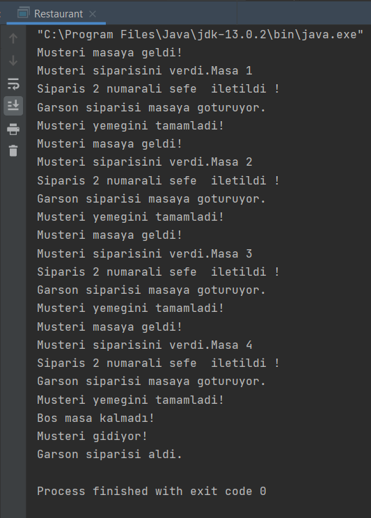

# Java Restaurant Simulator

Proje, nesne yönelimli programlama göz önünde bulundurularak geliştirilmiş olan bir restoran simulasyonudur. Chef, Meal, WaitPerson, BusBoy
ve main class olan Restaurant da dahil olmak üzere 5 adet sınıf oluşturulmuştur. Garson, şefin yemek hazırlamasını bekler. Şef bir yemeği 
hazırladığında garsona haber verir, garson yemeği alıp müşteriye teslim eder ve beklemeye döner. Yemek müşteriye teslim edildikten bir süre 
sonra sonra bekleme görevlisi temizlik için garsona haber verir.

Garson, şef ve bekleme görevlisi iş birliği içerisinde çalışırlar. Şef üretimi, bekleme görevlisi ise tüketimi temsil eder. Yemekler üretilirken 
ve tüketilirken her iki olay da birbirleri ile anlaşmalı ve duruma göre sistem düzenli bir şekilde kilitlenmelidir. Bunun için Lock ve Condition
objeleri oluşturulmuştur ve çalışma sistemi kontrol altına alınmıştır.

Gerçek hayatta olduğu gibi masalarda oturan müşterilerin, sipariş alan garsonların ve siparişleri hazırlayan şeflerin gerçekten olduğu gibi
birbirlerinden bağımsız çalışabilmesi ve her işlem sırasında ve sonrasında simulasyonun doğru çalıştığını anlayabilmemiz için uygun loglar ekrana
basılmıştır. 

Ekran çıktısı aşağıdaki gibidir:

